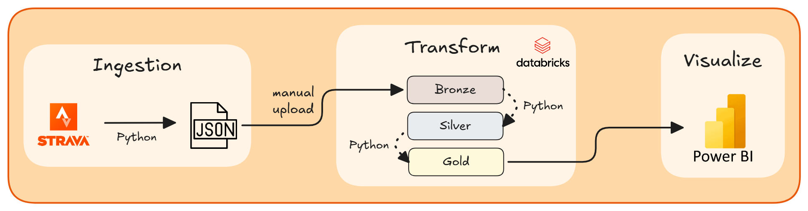

# Strava Data Analysis Project

A personal data engineering project that extracts, transforms, and visualizes Strava activity data through a full pipeline: from API ingestion to an interactive Power BI dashboard.

The pipeline covers:

- **OAuth authentication** and **data ingestion** from the Strava API
- **Data transformation** using Databricks (medallion architecture: bronze → silver → gold)
- **Interactive dashboard** built with Power BI

## I. Architecture Overview



## II. Prerequisites

| Tool                                                                     | Purpose                         |
| ------------------------------------------------------------------------ | ------------------------------- |
| Python 3.12                                                              | Data ingestion                  |
| Strava account with API credentials                                      | Data source                     |
| [Databricks Free Edition](https://www.databricks.com/learn/free-edition) | Data transformation             |
| [Power BI Desktop](https://powerbi.microsoft.com/desktop)                | Dashboard                       |
| [pbi-tools](https://pbi.tools/)                                          | Rebuild the `.pbix` from source |

## III. Pipeline

### 1. Data Ingestion

#### Installation

1. Clone the repository:

   ```bash
   git clone https://github.com/charlottekruzic/strava-data-analysis.git
   ```

2. Navigate to the project directory:

   ```bash
   cd strava-data-analysis
   ```

3. Install the dependencies:

   ```bash
   pip install -r requirements.txt
   ```

#### Configuration

1. [Log in](https://www.strava.com/register) to your Strava account

2. Obtain Strava API credentials by [creating an app](https://www.strava.com/settings/api)

3. Create a `.env` file and add your credentials:

   ```env
   STRAVA_CLIENT_ID=your_client_id
   STRAVA_CLIENT_SECRET=your_client_secret
   ```

#### Fetch your data

```bash
python ./ingestion/fetch_data.py
```

> Execution may take some time due to the [Strava API rate limits](https://developers.strava.com/docs/rate-limits/), which allow only 100 read requests every 15 minutes.

Raw data is saved as JSON files under `ingestion/raw_data/`.

### 2. Data Transformation (Databricks)

This step transforms the raw JSON data into gold-layer tables ready for Power BI, using a medallion architecture.

1. Create a [Databricks Free Edition](https://www.databricks.com/learn/free-edition) account
2. Import the notebooks located in each subfolder of `databricks/`
3. Manually upload the JSON files from `ingestion/raw_data/` into your Databricks volume, preserving the same subfolder structure as on your local machine
4. Run the `run_pipeline.py` notebook to execute the full pipeline

### 3. Power BI Dashboard


#### Connect to Databricks

Generate a [Databricks Personal Access Token (PAT)](https://docs.databricks.com/aws/en/dev-tools/auth/pat) and use it to authenticate when prompted in Power BI Desktop.

#### Rebuild the report from source

The `.pbix` file is not tracked in Git. The report source is versioned as extracted files under `powerbi/strava-data-analysis/`. To rebuild it locally:

```powershell
pbi-tools compile .\powerbi\strava-data-analysis -outPath .\powerbi\strava-data-analysis.pbit -format PBIT
```

Then open the generated `strava-data-analysis.pbit` in Power BI Desktop, reconfigure the Databricks connection under **Home > Transform data > Data source settings**, and refresh the data.
